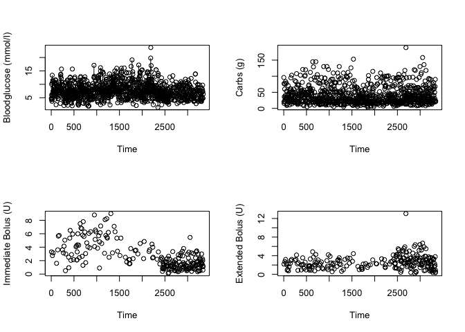

Initial Data Analysis
================

Personlized Bloodglucose Prediction
-----------------------------------

My journey in analyzing bloodglucose data of a type 1 diabetic patient, investigating the appropriate model design for this data and making predicitions based on this model/these models.

### Data

The data mainly concerns bloodglucose-levels, grams of carbohydrates consumed and insuline injections of one type 1 diabetic patient over the course of 6 months. For each event, the date, timestamp an a description of the even is available. Due to this, it is necessary to clean the data first. Below you can find the first few observations and a summary of the data before cleaning.

``` r
head(BGData)
```

    ##   DayOfWeek     Date  Time             Event Value   Unit  Descripition1
    ## 1       Wed 07.11.18 18:56             Carbs  96.0      g           <NA>
    ## 2       Wed 07.11.18 18:55      Bloodglucose   4.7 mmol/l           <NA>
    ## 3       Wed 07.11.18 16:31             Bolus   1.5      U Proposed bolus
    ## 4       Wed 07.11.18 16:31             Carbs  20.0      g           <NA>
    ## 5       Wed 07.11.18 16:09 Combination bolus   5.5      U   Direct dosis
    ## 6       Wed 07.11.18 16:08      Bloodglucose   4.3 mmol/l           <NA>
    ##   ValueD1  Descripition2 ValueD2              Descripition3 ValueD3
    ## 1      NA           <NA>      NA                       <NA>      NA
    ## 2      NA           <NA>      NA                       <NA>      NA
    ## 3     1.5           <NA>      NA                       <NA>      NA
    ## 4      NA           <NA>      NA                       <NA>      NA
    ## 5     3.3 Extended dosis     2.2 Duration of Extended dosis      60
    ## 6      NA           <NA>      NA                       <NA>      NA
    ##    Descripition4 ValueD4 Descripition5
    ## 1           <NA>      NA          <NA>
    ## 2           <NA>      NA          <NA>
    ## 3           <NA>      NA          <NA>
    ## 4           <NA>      NA          <NA>
    ## 5 Proposed bolus     5.5          <NA>
    ## 6           <NA>      NA          <NA>

``` r
summary(BGData)
```

    ##  DayOfWeek       Date           Time     
    ##  Fri:426   24.09.18:  29   23:59  : 190  
    ##  Mon:498   09.08.18:  28   07:39  :  20  
    ##  Sat:477   10.07.18:  26   07:43  :  19  
    ##  Sun:475   21.05.18:  26   07:27  :  18  
    ##  Thu:490   22.09.18:  26   07:31  :  14  
    ##  Tue:489   09.09.18:  25   18:50  :  14  
    ##  Wed:488   (Other) :3183   (Other):3068  
    ##                           Event          Value            Unit     
    ##  Bloodglucose                :1090   Min.   :  0.05   g     : 941  
    ##  Carbs                       : 941   1st Qu.:  4.00   mmol/l:1090  
    ##  Bolus                       : 746   Median :  8.05   U     :1174  
    ##  Combination bolus           : 231   Mean   : 16.99   NA's  : 138  
    ##  Total amount insulin per day: 183   3rd Qu.: 21.95                
    ##  Pod activated               :  63   Max.   :189.00                
    ##  (Other)                     :  89   NA's   :138                   
    ##                     Descripition1     ValueD1               Descripition2 
    ##  Before meal               :   2   Min.   : 0.050   Basal insulin  : 183  
    ##  Bolus insulin             : 180   1st Qu.: 1.550   Bolus cancelled:   2  
    ##  Direct dosis              : 225   Median : 2.650   Extended dosis : 231  
    ##  Duration of Extended dosis:  14   Mean   : 5.422   Proposed bolus :  14  
    ##  Occlusion found           :   1   3rd Qu.: 5.050   NA's           :2913  
    ##  Proposed bolus            : 724   Max.   :90.000                         
    ##  NA's                      :2197   NA's   :2179                           
    ##     ValueD2                          Descripition3     ValueD3    
    ##  Min.   : 0.200   Duration of Extended dosis: 231   Min.   : 30   
    ##  1st Qu.: 2.200   NA's                      :3112   1st Qu.: 60   
    ##  Median : 4.150                                     Median : 60   
    ##  Mean   : 4.358                                     Mean   : 85   
    ##  3rd Qu.: 6.400                                     3rd Qu.:120   
    ##  Max.   :13.050                                     Max.   :150   
    ##  NA's   :2915                                       NA's   :3112  
    ##         Descripition4     ValueD4               Descripition5 
    ##  Proposed bolus: 231   Min.   : 0.550   Bolus cancelled:   1  
    ##  NA's          :3112   1st Qu.: 3.325   NA's           :3342  
    ##                        Median : 5.000                         
    ##                        Mean   : 5.271                         
    ##                        3rd Qu.: 6.600                         
    ##                        Max.   :14.500                         
    ##                        NA's   :3112

#### Cleaning Data

We can see that the variable Event has many categories all measured in different ways. The category Carb (which indicates that the patient has eaten a meal that contained carbohydrates) is measured in grams (g) and can be easily seperated into its own variable. The latter is also true voor category Bloodglucose (bloodglucose value measured at a particular point of time in mmol/l).

The Carbs variable can be created by executing the following piece of code.

``` r
Carbs = rep(NA, 3343)
Carbs[BGData$Event == "Carbs"] = BGData$Value[BGData$Event == "Carbs"]
head(data.frame(BGData$Event, BGData$Value, Carbs))
```

    ##        BGData.Event BGData.Value Carbs
    ## 1             Carbs         96.0    96
    ## 2      Bloodglucose          4.7    NA
    ## 3             Bolus          1.5    NA
    ## 4             Carbs         20.0    20
    ## 5 Combination bolus          5.5    NA
    ## 6      Bloodglucose          4.3    NA

The last line allows us to check whether the transformation is performed correctly. Similarly, for Bloodglucose we execute

``` r
Bloodglucose = rep(NA, 3343)
Bloodglucose[BGData$Event == "Bloodglucose"] = BGData$Value[BGData$Event == "Bloodglucose"]
head(data.frame(BGData$Event, BGData$Value, Bloodglucose))
```

    ##        BGData.Event BGData.Value Bloodglucose
    ## 1             Carbs         96.0           NA
    ## 2      Bloodglucose          4.7          4.7
    ## 3             Bolus          1.5           NA
    ## 4             Carbs         20.0           NA
    ## 5 Combination bolus          5.5           NA
    ## 6      Bloodglucose          4.3          4.3

Now we can transform the original variable Event and corresponding variable Value to discard the information on Carbs and Bloodglucose.

``` r
BGData$Value[BGData$Event == "Carbs"] = NA
BGData$Value[BGData$Event == "Bloodglucose"] = NA
BGData$Event[BGData$Event == "Carbs"] = NA
BGData$Event[BGData$Event == "Bloodglucose"] = NA
BGData$Event = factor(BGData$Event)
head(BGData)
```

    ##   DayOfWeek     Date  Time             Event Value   Unit  Descripition1
    ## 1       Wed 07.11.18 18:56              <NA>    NA      g           <NA>
    ## 2       Wed 07.11.18 18:55              <NA>    NA mmol/l           <NA>
    ## 3       Wed 07.11.18 16:31             Bolus   1.5      U Proposed bolus
    ## 4       Wed 07.11.18 16:31              <NA>    NA      g           <NA>
    ## 5       Wed 07.11.18 16:09 Combination bolus   5.5      U   Direct dosis
    ## 6       Wed 07.11.18 16:08              <NA>    NA mmol/l           <NA>
    ##   ValueD1  Descripition2 ValueD2              Descripition3 ValueD3
    ## 1      NA           <NA>      NA                       <NA>      NA
    ## 2      NA           <NA>      NA                       <NA>      NA
    ## 3     1.5           <NA>      NA                       <NA>      NA
    ## 4      NA           <NA>      NA                       <NA>      NA
    ## 5     3.3 Extended dosis     2.2 Duration of Extended dosis      60
    ## 6      NA           <NA>      NA                       <NA>      NA
    ##    Descripition4 ValueD4 Descripition5
    ## 1           <NA>      NA          <NA>
    ## 2           <NA>      NA          <NA>
    ## 3           <NA>      NA          <NA>
    ## 4           <NA>      NA          <NA>
    ## 5 Proposed bolus     5.5          <NA>
    ## 6           <NA>      NA          <NA>

Transforming the remainder of the categories in Event is a bit more complicated. The injection of insulin (bolus) is subdivided into multiple categories, which need to be extracted from the description. The various categories of this variable are

``` r
levels(BGData$Event)
```

    ##  [1] "Bolus"                        "Combination bolus"           
    ##  [3] "Extended bolus"               "Pod activated"               
    ##  [5] "Pod deactivated"              "Pump is started"             
    ##  [7] "Pump is stopped"              "Time change (Winter time)"   
    ##  [9] "Total amount insulin per day" "Warning"

Three out of 10 categories are related to bolusses: Bolus, Combination bolus, Extended bolus. One seems to be related to insulin injection, but isn't called a bolus: Total amount insulin per day. The remainder of the categories pertain to other events related to the insulin pump (the device that regulates the insulin injection), pod (a tube placed into the pump that contains the insulin), some warnings and the change of time. Let's view the categories of the description variables.

``` r
levels(BGData$Descripition1)
```

    ## [1] "Before meal"                "Bolus insulin"             
    ## [3] "Direct dosis"               "Duration of Extended dosis"
    ## [5] "Occlusion found"            "Proposed bolus"

``` r
levels(BGData$Descripition2)
```

    ## [1] "Basal insulin"   "Bolus cancelled" "Extended dosis"  "Proposed bolus"

``` r
levels(BGData$Descripition3)
```

    ## [1] "Duration of Extended dosis"

``` r
levels(BGData$Descripition4)
```

    ## [1] "Proposed bolus"

``` r
levels(BGData$Descripition5)
```

    ## [1] "Bolus cancelled"

A quick analysis of the data together with the previous information leads to the following conclusions 1. Event "Total amount insulin per day" is a summary of the day's total insulin usage. In the description, this entry is broken up into two pieces of information: the "Bolus insulin" (total insulin injected directly as a result of eating or in order to correct for high bloodsugar) and the "Basal insulin" (insulin injection is spread over time). 2. Event "Bolus", and "Combination bolus" mean that the pump was intructed to give insulin to the patient. While"Bolus" indicates injection pretty much immediately, with "Extended bolus" it will be injected slowly over a specified time window. A "Combination bolus" is the combination of these two options.

Due the aforementioned, the following variables are created

``` r
ImmediateBolus = rep(NA, 3343)
ImmediateBolus[BGData$Descripition1 == "Direct dosis"&!is.na(BGData$Descripition1)] = BGData$ValueD1[BGData$Descripition1 == "Direct dosis"&!is.na(BGData$Descripition1)]
ExtendedBolus = rep(NA, 3343)
ExtendedBolus[BGData$Descripition2 == "Extended dosis"&!is.na(BGData$Descripition2)] = BGData$ValueD2[BGData$Descripition2 == "Extended dosis"&!is.na(BGData$Descripition2)]
DailyTotalBasalInsulin = rep(NA, 3343)
DailyTotalBasalInsulin[BGData$Descripition2 == "Basal insulin"&!is.na(BGData$Descripition2)] = BGData$ValueD2[BGData$Descripition2 == "Basal insulin"&!is.na(BGData$Descripition2)]
DailyTotalImmediateInsulin = rep(NA, 3343)
DailyTotalImmediateInsulin[BGData$Descripition1 == "Bolus insulin"&!is.na(BGData$Descripition1)] = BGData$ValueD1[BGData$Descripition1 == "Bolus insulin"&!is.na(BGData$Descripition1)]
BolusCancelled = rep(0, 3343)
BolusCancelled[BGData$Descripition2 == "Bolus cancelled"&!is.na(BGData$Descripition2)] = rep(1:3343)[BGData$Descripition2 == "Bolus cancelled"&!is.na(BGData$Descripition2)]
BolusCancelled[BGData$Descripition5 == "Bolus cancelled"&!is.na(BGData$Descripition5)] = rep(1:3343)[BGData$Descripition5 == "Bolus cancelled"&!is.na(BGData$Descripition5)]
BeforeMeal = rep(0, 3343)
BeforeMeal[BGData$Descripition1 == "Before meal"&!is.na(BGData$Descripition1)] = rep(1:3343)[BGData$Descripition1 == "Before meal"&!is.na(BGData$Descripition1)]
Occlusion = rep(0, 3343)
Occlusion[BGData$Descripition1 == "Occlusion found"&!is.na(BGData$Descripition1)] = rep(1:3343)[BGData$Descripition1 == "Occlusion found"&!is.na(BGData$Descripition1)]
ProposedBolus = rep(0, 3343)
ProposedBolus[BGData$Descripition1 == "Proposed bolus"&!is.na(BGData$Descripition1)] = BGData$ValueD1[BGData$Descripition1 == "Proposed bolus"&!is.na(BGData$Descripition1)]
ProposedBolus[BGData$Descripition2 == "Proposed bolus"&!is.na(BGData$Descripition2)] = BGData$ValueD2[BGData$Descripition2 == "Proposed bolus"&!is.na(BGData$Descripition2)]
ProposedBolus[BGData$Descripition4 == "Proposed bolus"&!is.na(BGData$Descripition4)] = BGData$ValueD4[BGData$Descripition4 == "Proposed bolus"&!is.na(BGData$Descripition4)]
DurationExtDos = rep(0, 3343)
DurationExtDos[BGData$Descripition1 == "Duration of Extended dosis"&!is.na(BGData$Descripition1)] = BGData$ValueD1[BGData$Descripition1 == "Duration of Extended dosis"&!is.na(BGData$Descripition1)]
DurationExtDos[BGData$Descripition3 == "Duration of Extended dosis"&!is.na(BGData$Descripition3)] = BGData$ValueD3[BGData$Descripition3 == "Duration of Extended dosis"&!is.na(BGData$Descripition3)]
```

This concludes the extraction of information for all bolus related events. The following dummy variables are created for the remaining events.

``` r
PodAct = rep(0, 3343)
PodAct[BGData$Event == "Pod activated"] = 1
PodDeAct = rep(0, 3343)
PodDeAct[BGData$Event == "Pod deactivated"] = 1
PumpStart = rep(0, 3343)
PumpStart[BGData$Event == "Pump is started"] = 1
PumpStop = rep(0, 3343)
PumpStop[BGData$Event == "Time change (Winter time)"] = 1
TimeChange = rep(0, 3343)
TimeChange[BGData$Event == "Pod activated"] = 1
Warning  = rep(0, 3343)
Warning[BGData$Event == "Warning"] = 1
```

Combining all these newly created variables into a dateframe together with the day, date and timestamp results in the cleaned dataset.

``` r
CleanedBGData = data.frame(BGData$DayOfWeek, BGData$Date, BGData$Time, BeforeMeal, Bloodglucose, BolusCancelled, Carbs, DailyTotalBasalInsulin, DailyTotalImmediateInsulin, DurationExtDos, ExtendedBolus, ImmediateBolus, Occlusion, PodAct, PodDeAct, ProposedBolus, PumpStart, PumpStop, TimeChange)
names(CleanedBGData)[1:3] = c("DayOfWeek", "Date", "Time")
save(CleanedBGData, file = "CleanedBGData.RData")
```

### Data Visualization

``` r
par(mfrow=c(2,2))
plot(CleanedBGData$Bloodglucose, type = "o", ylab = "Bloodglucose (mmol/l)", xlab = "Time")
plot(CleanedBGData$Carbs, type = "o", ylab = "Carbs (g)", xlab = "Time")
plot(CleanedBGData$ImmediateBolus, type = "o", ylab = "Immediate Bolus (U)", xlab = "Time")
plot(CleanedBGData$ExtendedBolus, type = "o", ylab = "Extended Bolus (U)", xlab = "Time")
```


